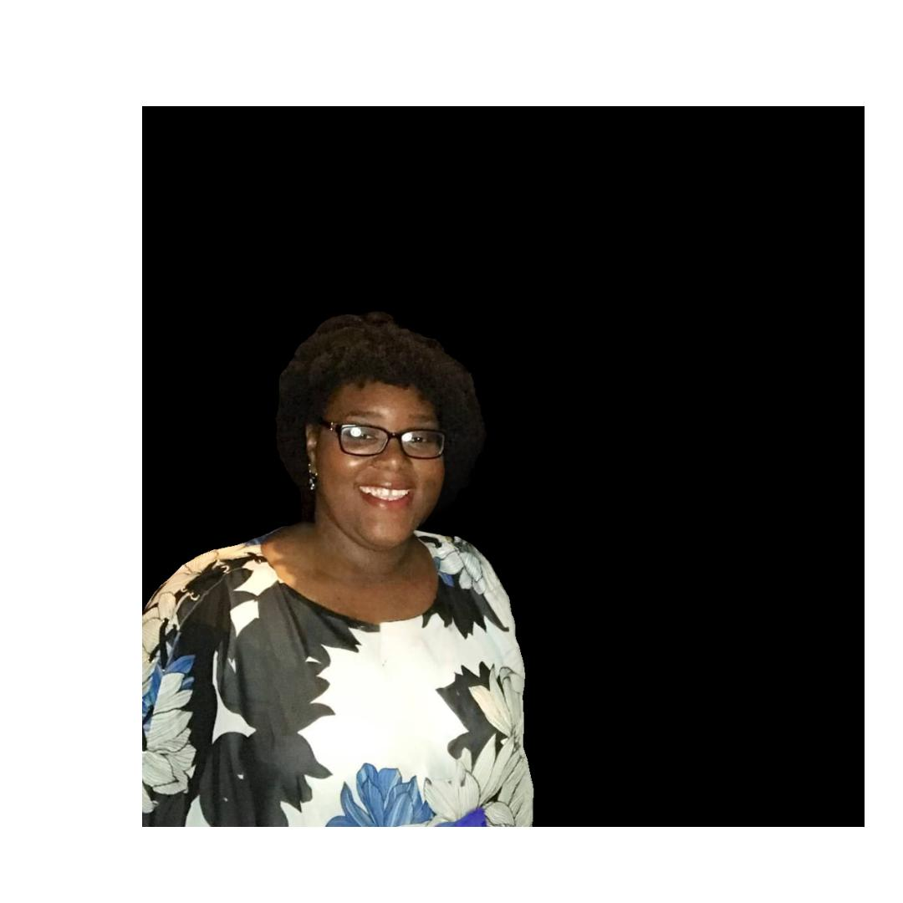

# 👋 Hi there, I'm **Deanna Trimble**                   

🌍 Garland, TX  
📧 [deannatrimble@gmail.com](mailto:deannatrimble@gmail.com)  
🔗 [linkedin.com/in/deanna-trimble-2b21b5315](https://www.linkedin.com/in/deanna-trimble-2b21b5315)

---

## 🧩 About Me

I’m an **education and technology professional** with over **11 years of experience** in after-school program management, curriculum development, and student engagement.  
My work bridges **education and IT**, blending hands-on learning leadership with technical problem-solving and digital literacy.

💡 I’m passionate about:
- Creating innovative learning environments that foster student growth.  
- Applying IT and troubleshooting skills to improve program efficiency.  
- Helping others develop confidence through tech education.  

---

## 🧠 Skills & Tools

### 🏫 Education & Leadership
- Program Management • Curriculum Design • Staff Training  
- Behavioral Support • Parent & Teacher Collaboration  
- Policy Development • Student Mentorship  

### 💻 Technical & IT

---

## 💼 Experience

### **After School Program Director / Substitute Teacher**  
*ResponsiveEd – Garland, TX*  
📅 *Aug 2021 – Present*  
- Lead academic and enrichment programs enhancing student achievement and engagement.  
- Collaborate with staff and parents to address learning challenges and behavior management.  
- Develop instructional strategies and contribute to policy and program goals.  

---

### **Program Manager**  
*Right at School – Plano, TX*  
📅 *Aug 2020 – May 2021*  
- Managed after-school site operations, curriculum resources, and inventory.  
- Supervised and trained educational teams for high-quality delivery.  
- Reported outcomes and metrics to senior management.  

---

### **Educator**  
*Elite Learning – Plano, TX*  
📅 *Aug 2019 – Mar 2020*  
- Designed and implemented engaging literacy and enrichment curriculum.  
- Delivered instruction to diverse learners, fostering creativity and confidence.  

---

### **Floater / After School Teacher**  
*Primrose School of Firewheel – Garland, TX*  
📅 *Sep 2016 – Aug 2019*  
- Facilitated student learning through social, physical, and intellectual activities.  
- Ensured safe classroom transitions and nurturing educational spaces.  

---

## 🎓 Education

🎓 **Associate of Science Degree**  
*Richland College – Dallas, TX*  
📅 *Expected Spring 2026*

💻 **IT Support Professional Certificate**  
*Completed November 2024*

---

## 🪪 Certifications

- ❤️ CPR Certified – Nov 2025 to Nov 2027  

---

## 💬 Additional Info

- **Languages:** English  
- **Volunteer Work:** Mentorship and youth support in community after-school programs  
- **Interests:** Educational technology, coding, and youth leadership initiatives  

---

## 🤝 Let’s Connect!

💌 [Email Me](mailto:deannatrimble@gmail.com)  
🔗 [LinkedIn](https://www.linkedin.com/in/deanna-trimble-2b21b5315)  
⭐ If you enjoy my work or share my interests, feel free to connect or collaborate!

---

